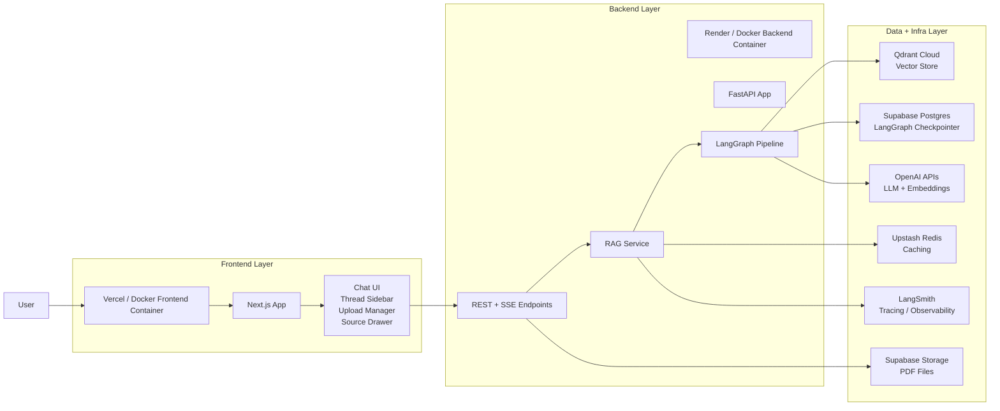
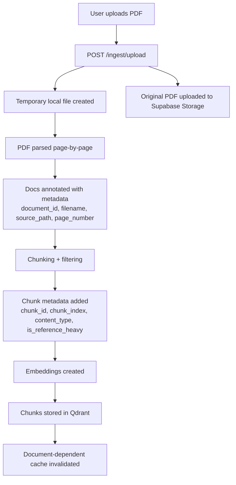
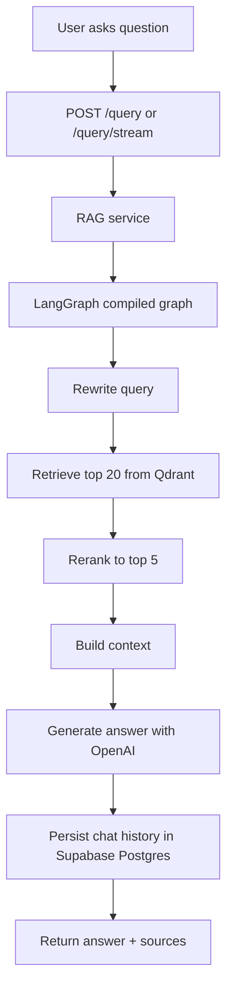
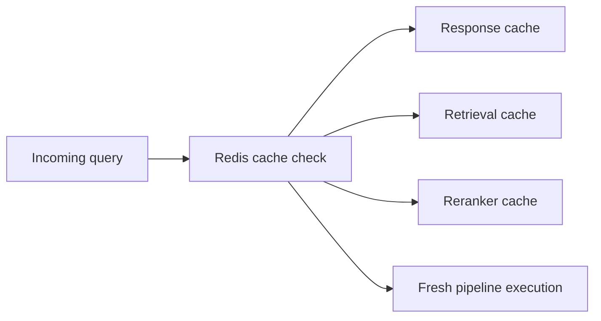
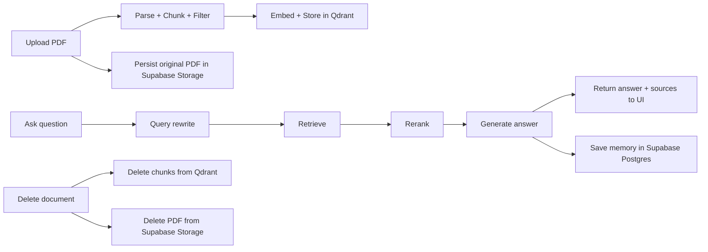

# DocBot System Design

This document describes the full architecture of DocBot, including every major component, where it is placed, and how the data flows through the system.

## 1. High-Level Architecture

## 2. Deployment Placement

### Frontend
- **Placed on:** Vercel or local Docker container
- **Main code:** [page.tsx](/Users/amit/Desktop/DocuBot/DocBot/frontend/src/app/page.tsx), [layout.tsx](/Users/amit/Desktop/DocuBot/DocBot/frontend/src/app/layout.tsx), [globals.css](/Users/amit/Desktop/DocuBot/DocBot/frontend/src/app/globals.css)
- **Responsibilities:**
  - chat UI
  - thread list
  - upload flow
  - streaming token rendering
  - source chips and source detail expansion
  - conversation restore

### Backend
- **Placed on:** Render or local Docker container
- **Entry point:** [main.py](/Users/amit/Desktop/DocuBot/DocBot/app/main.py)
- **Responsibilities:**
  - expose API routes
  - handle PDF ingestion
  - route user queries into the RAG pipeline
  - stream answers over SSE
  - coordinate caching, storage, retrieval, reranking, generation, and memory

### External Managed Services
- **Qdrant Cloud**
  - stores chunk embeddings and metadata
- **Supabase Storage**
  - stores uploaded PDF files
- **Supabase Postgres**
  - stores LangGraph conversation checkpoints
- **Upstash Redis**
  - caches retrieval, rerank, and response results
- **OpenAI**
  - embeddings
  - query rewriting
  - final answer generation
  - image-aware PDF parsing support via parser LLM usage
- **LangSmith**
  - tracing and observability

## 3. Backend Components

### API Layer
- **File:** [routes.py](/Users/amit/Desktop/DocuBot/DocBot/app/api/routes.py)
- **Key endpoints:**
  - `GET /health`
  - `POST /ingest/upload`
  - `GET /documents`
  - `DELETE /documents/{document_id}`
  - `POST /query`
  - `POST /query/stream`
  - `GET /threads/{thread_id}/history`
  - `GET /embed/count`
  - `GET /cache/stats`
  - `POST /cache/clear`

### Core Config + Infra Helpers
- **Files:**
  - [config.py](/Users/amit/Desktop/DocuBot/DocBot/app/core/config.py)
  - [cache.py](/Users/amit/Desktop/DocuBot/DocBot/app/core/cache.py)
  - [logger.py](/Users/amit/Desktop/DocuBot/DocBot/app/core/logger.py)
- **Responsibilities:**
  - central env/config loading
  - Redis access
  - TTL-based caching
  - logging

### Vector DB Layer
- **File:** [vector_db.py](/Users/amit/Desktop/DocuBot/DocBot/app/db/vector_db.py)
- **Responsibilities:**
  - create/get Qdrant client
  - create/get LangChain Qdrant vector store
  - create embeddings client lazily
  - count chunks
  - aggregate indexed documents
  - delete documents from Qdrant

### RAG Orchestration
- **Files:**
  - [rag_service.py](/Users/amit/Desktop/DocuBot/DocBot/app/services/rag_service.py)
  - [graph.py](/Users/amit/Desktop/DocuBot/DocBot/app/services/graph.py)
  - [nodes.py](/Users/amit/Desktop/DocuBot/DocBot/app/services/nodes.py)
  - [state.py](/Users/amit/Desktop/DocuBot/DocBot/app/services/state.py)
- **Responsibilities:**
  - invoke LangGraph
  - stream graph progress + tokens
  - maintain conversation memory
  - transform reranked docs into source metadata for the frontend

### Retrieval + Ranking + Generation
- **Files:**
  - [retrieval.py](/Users/amit/Desktop/DocuBot/DocBot/app/services/retrieval.py)
  - [reranker.py](/Users/amit/Desktop/DocuBot/DocBot/app/services/reranker.py)
  - [generation.py](/Users/amit/Desktop/DocuBot/DocBot/app/services/generation.py)
- **Responsibilities:**
  - similarity search against Qdrant
  - cross-encoder reranking
  - metadata-aware ranking adjustments
  - final LLM answer generation

### Cloud File Storage
- **File:** [document_storage.py](/Users/amit/Desktop/DocuBot/DocBot/app/services/document_storage.py)
- **Responsibilities:**
  - upload PDFs to Supabase Storage
  - delete PDFs from Supabase Storage
  - fall back to local file storage when storage env vars are not configured

## 4. Ingestion Pipeline

### Parsing
- **File:** [loader.py](/Users/amit/Desktop/DocuBot/DocBot/ingestion/loader.py)
- **Current parser:** `PyMuPDF4LLMLoader`
- **Behavior:**
  - parses one document per page
  - extracts tables
  - uses an LLM-based image parser when needed

### Chunking
- **File:** [chunking.py](/Users/amit/Desktop/DocuBot/DocBot/ingestion/chunking.py)
- **Behavior:**
  - recursive chunking
  - configurable size/overlap
  - low-signal filtering
  - metadata annotation

### Chunk Metadata Stored
- `document_id`
- `filename`
- `source_path`
- `page_number`
- `chunk_id`
- `chunk_index`
- `content_type`
- `is_reference_heavy`

## 5. Query Pipeline

### Query Rewrite
- uses chat history
- resolves follow-up questions into standalone queries

### Retrieval
- similarity search from Qdrant
- retrieval cache can short-circuit repeated queries

### Reranking
- semantic reranker via cross-encoder
- metadata-aware boosts/demotions:
  - body text preferred for most questions
  - references demoted
  - figure captions boosted only for figure-like questions
  - tables boosted for result/comparison-like questions

### Context Build
- reranked documents are concatenated into final context
- source metadata is extracted into frontend-friendly source cards

### Generation
- prompt template + GPT-4o-mini
- supports streaming token output

### Memory
- LangGraph checkpointing persists thread-level conversation state
- each thread is keyed by `thread_id`

## 6. Caching Layer

### Cache Placement
- **Placed on:** Upstash Redis
- **Managed in:** [cache.py](/Users/amit/Desktop/DocuBot/DocBot/app/core/cache.py)

### Cached Layers
- response cache
- retrieval cache
- reranker cache

### Cache Invalidation
- on document ingest
- on document delete

## 7. Conversation Memory Design

### Storage Placement
- **Placed on:** Supabase Postgres
- **Managed in:** [graph.py](/Users/amit/Desktop/DocuBot/DocBot/app/services/graph.py)

### Behavior
- one conversation per `thread_id`
- shared history across multiple queries in that thread
- restored by frontend thread selection
- async checkpointer lifecycle managed separately from request handling

## 8. Source Attribution Design

### Source Generation
- built from reranked documents
- shaped in:
  - [nodes.py](/Users/amit/Desktop/DocuBot/DocBot/app/services/nodes.py)
  - [rag_service.py](/Users/amit/Desktop/DocuBot/DocBot/app/services/rag_service.py)

### What is returned
- `document_id`
- `filename`
- `source_path`
- `page_number`
- `chunk_id`
- `excerpt`

### Where shown
- frontend source chips
- expandable source detail panels
- restored conversation history for newer messages

## 9. Frontend Component Design

### Main UI Placement
- **File:** [page.tsx](/Users/amit/Desktop/DocuBot/DocBot/frontend/src/app/page.tsx)

### Main responsibilities
- maintain current thread state
- render chat messages
- show streaming answer tokens
- upload PDFs
- list indexed PDFs
- delete indexed PDFs
- render source chips/details
- reload prior threads

### Styling Placement
- **Files:**
  - [globals.css](/Users/amit/Desktop/DocuBot/DocBot/frontend/src/app/globals.css)
  - Tailwind config in `frontend/tailwind.config.js`

## 10. Docker and Deployment Design

### Docker
- **Backend image:** [Dockerfile](/Users/amit/Desktop/DocuBot/DocBot/Dockerfile)
- **Frontend image:** [frontend/Dockerfile](/Users/amit/Desktop/DocuBot/DocBot/frontend/Dockerfile)
- **Compose file:** [docker-compose.yml](/Users/amit/Desktop/DocuBot/DocBot/docker-compose.yml)
- **Purpose:**
  - reproducible local demo
  - portfolio showcase
  - simpler reviewer setup

### Cloud Deployment Targets
- **Frontend:** Vercel
- **Backend:** Render
- **Managed infra:** Qdrant, Supabase, Upstash, OpenAI, LangSmith

## 11. Evaluation and Quality Layer

### Test Placement
- **File:** [test_rag.py](/Users/amit/Desktop/DocuBot/DocBot/tests/test_rag.py)

### Current evaluation coverage
- Context Precision
- Context Recall
- Faithfulness
- Answer Relevancy

These tests evaluate the actual retrieval and generation stack against a curated `TESTSET`.

## 12. End-to-End Lifecycle

## 13. Summary

DocBot is a full-stack RAG system with:
- a Next.js chat frontend
- a FastAPI + LangGraph backend
- Qdrant for vector retrieval
- Supabase Storage for PDFs
- Supabase Postgres for conversation memory
- Upstash Redis for caching
- OpenAI for embeddings and answer generation
- LangSmith for tracing
- Docker for reproducible local demos

The architecture is designed to support:
- PDF ingestion
- grounded question answering
- source-aware responses
- persistent multi-thread conversations
- evaluation-driven iteration
